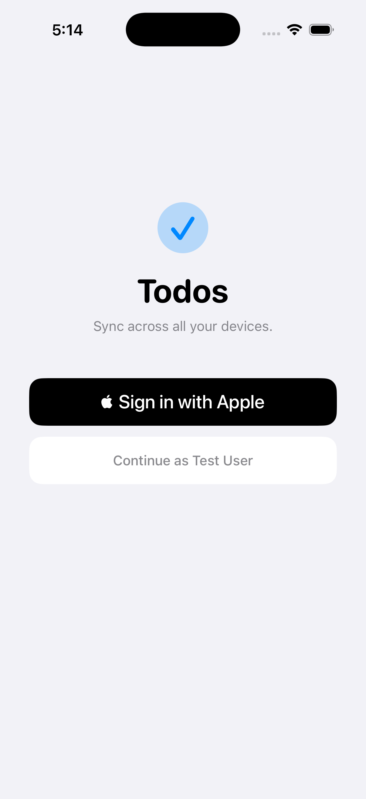
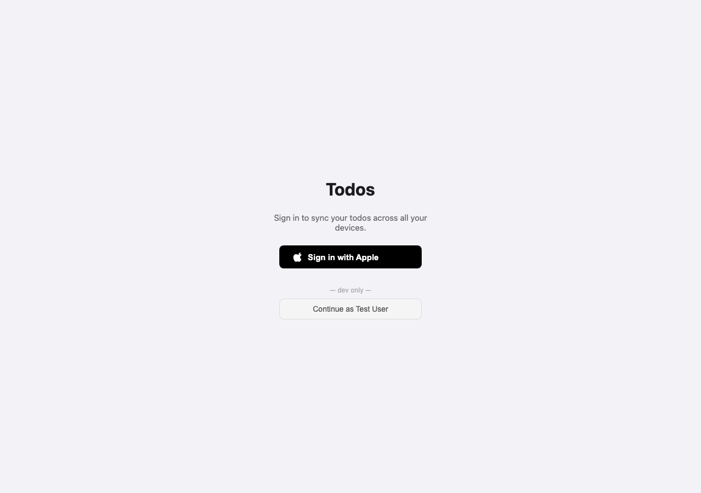

# Todo App

Multiplatform todo app — React web + native SwiftUI iOS — with real-time sync, Apple Sign In, and a shared TypeScript data layer.

## Screenshots

<table>
  <tr>
    <td align="center"><b>iOS</b></td>
    <td align="center"><b>Web</b></td>
  </tr>
  <tr>
    <td></td>
    <td></td>
  </tr>
</table>

## Features

- **Real-time sync** — WebSocket pushes changes instantly across all connected devices
- **Apple Sign In** — native on iOS, JS SDK on web
- **Offline-resilient** — REST fallback polling when WebSocket is unavailable
- **Settings** — light/dark/system appearance, account info, What's New
- **Version history** — in-app changelog accessible from settings

## Structure

```
todo-app/
├── packages/shared/   # TypeScript types, changelog
├── apps/api/          # Express + SQLite + WebSocket backend
├── apps/web/          # Vite + React
└── apps/mobile/       # SwiftUI iOS (XcodeGen)
```

## Getting started

```bash
npm install
npm start
# API  → http://localhost:3001
# Web  → http://localhost:5173
```

### iOS

```bash
cd apps/mobile
xcodegen generate
open TodoApp.xcodeproj
```

## Commands

| Command | Description |
|---------|-------------|
| `npm start` | Start API + web together |
| `npm run web` | Web only |
| `npm run api` | API only |
| `npm test` | Run all tests |
| `npm run lint` | Lint all packages |
| `npm run build` | Production web build |

## Testing

```bash
npm test
# 18 tests across shared, api, and web packages
```

## Tech stack

| Layer | Stack |
|-------|-------|
| Web | Vite, React, TypeScript |
| iOS | SwiftUI, XcodeGen, XCTest |
| API | Express, better-sqlite3, ws |
| Auth | Apple Sign In, JWT, refresh tokens |
| CI | GitHub Actions |
| Infra | Docker, docker-compose |

## CI

GitHub Actions runs on every push and PR across 4 jobs: lint, web build, API tests, iOS build.
